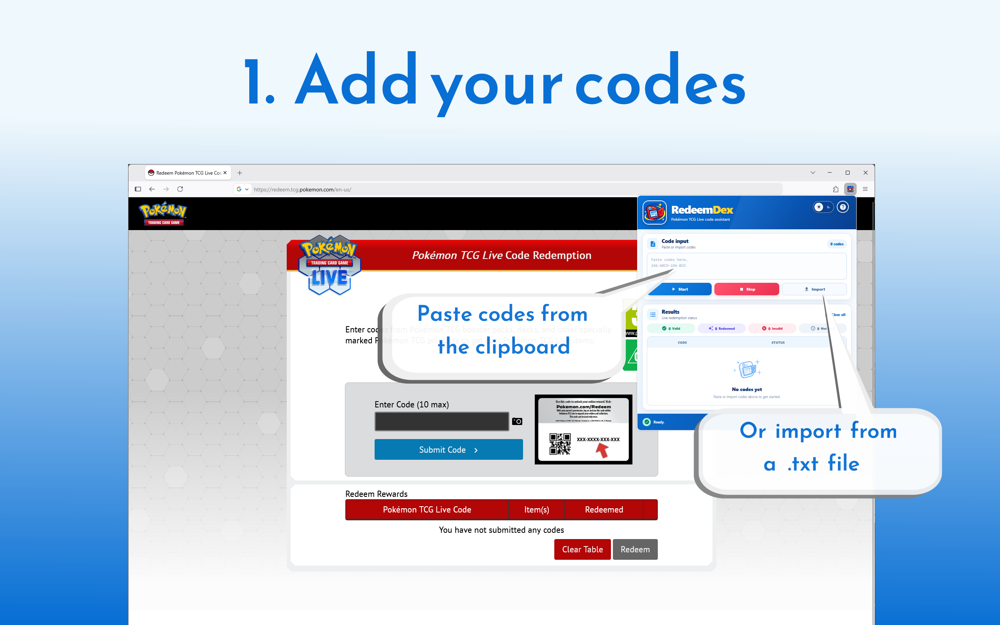
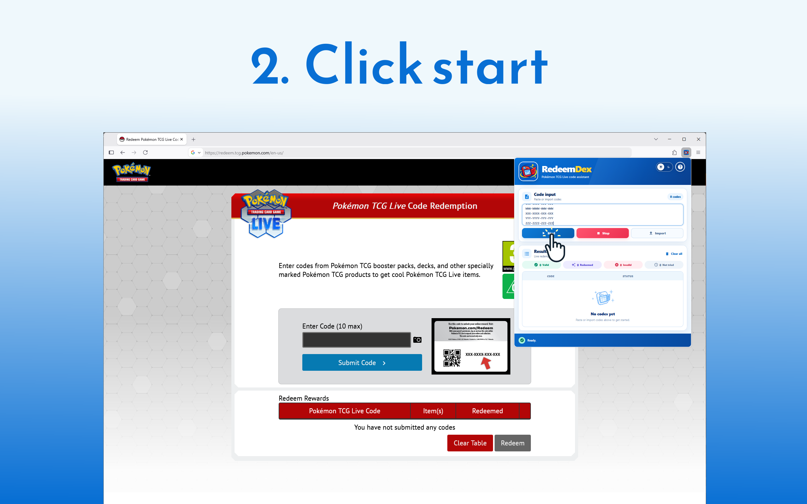
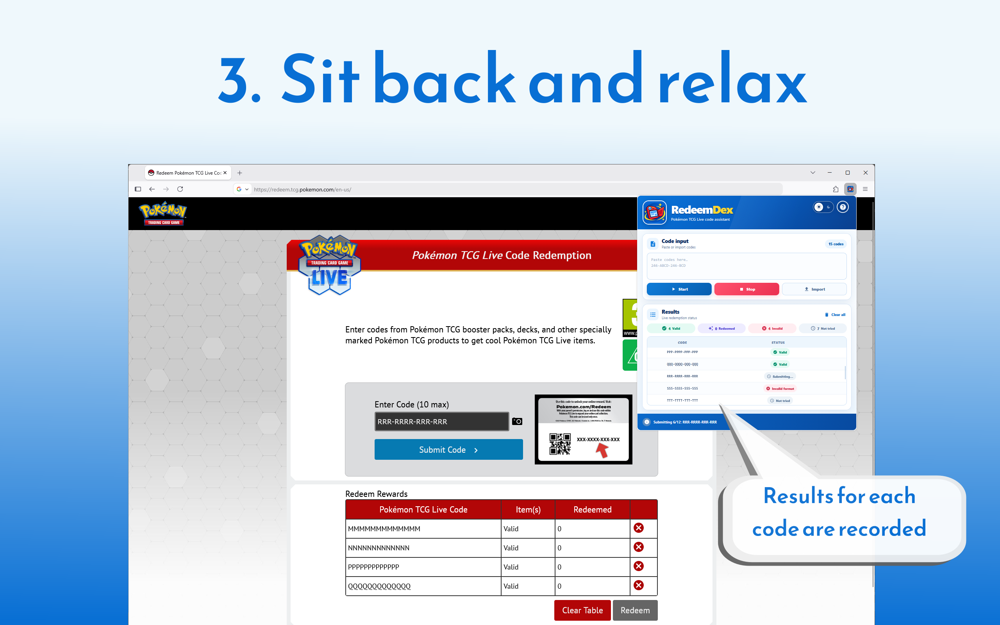

# RedeemDex

[](https://opensource.org/licenses/MIT)
[](https://addons.mozilla.org/en-GB/firefox/addon/redeemdex/)

### Redeeming Pokémon TCG Live codes made easy.

<p align="center">

</p>

RedeemDex is a browser extension for entering, validating, importing, and
batch-redeeming Pokémon TCG Live codes. The same source builds packages for
both Firefox and Chrome. It keeps the code list and redemption
status in local extension storage while the content script operates on the
official redemption page.

### Acknowledgments

This project is co-authored by GPT-5.6 Luna. 

## Features

- Paste multiple codes into the React toolbar popup.
- Import one or more codes from a `.txt` file using a separate drag-and-drop window.
- Validate code format before redemption.
- Prevent duplicates, including codes already saved in the extension.
- Track pending, valid, redeemed, invalid, and failed codes.
- Detect redemption activity performed directly on the redemption page.
- Follow the system theme or switch between light and dark themes.

## How to use

1. Open RedeemDex from the extensions toolbar.
2. Paste codes into the input area, or choose **Import** and select/drag-and-drop a `.txt` file.
3. Review the list and click **Start**.
4. Sign in, if needed.
5. Sit back and relax as **RedeemDex** processes all your codes.

|  |  |  |
| :--- | :---: | ---: |
|  |    |  |

## Privacy

Codes and statuses are stored with the extension's local storage. RedeemDex
does not send codes to a separate server. Redemption requests are performed by
the Pokémon TCG Live redemption page in the browser.

## Contributing

If you would like to contribute to this project, please feel free to open an 
issue to discuss an idea or submit a pull request with a focused change. Include 
clear steps to reproduce bugs and verify any behavioral changes when possible.

### Requirements

- Node.js and npm
- Firefox or Chrome

### Building from source

Clone the repo, then install dependencies and build the extension:

```bash
npm install
npm run build:extension
```

Installing dependencies also enables the Husky pre-commit hook. Each commit
runs `npx lint-staged`, which runs `biome check --write` on staged changes.

The output is written to `extension/dist/firefox/` and `extension/dist/chrome/`.
To load the Firefox build temporarily:

1. Open [`about:debugging#/runtime/this-firefox`](about:debugging#/runtime/this-firefox).
2. Click **Load Temporary Add-on**.
3. Select `extension/dist/firefox/manifest.json`.

Rebuild after source changes and reload the temporary add-on from the same page.

To load the Chrome build, open `chrome://extensions`, enable **Developer mode**,
click **Load unpacked**, and select `extension/dist/chrome/`.

### Local mock

The repository includes a local mock redemption page for testing without contacting
Pokémon services. It uses the same DOM patterns expected by the content script
and returns simulated redemption outcomes.

Build and serve the mock from the repository root:

```bash
npm run mock
```

Then open `http://127.0.0.1:8000/` and load the extension from
`extension/dist/`. The mock is covered by the extension's local host permission in both browser builds.

For Vite development mode:

```bash
npm run dev:mock
```

### Development commands

| Command | Purpose |
| --- | --- |
| `npm run build` | Build the extension and mock |
| `npm run build:extension` | Build only the extension |
| `npm run build:mock` | Build only the mock |
| `npm run check` | Run Biome checks and TypeScript checks |
| `npm run typecheck` | Type-check the extension and mock |
| `npm test` | Run the test suite |
| `npm run dev:extension` | Watch the extension build |
| `npm run dev:mock` | Start the mock in Vite development mode |

### Project layout

```text
extension/
├── src/
│   ├── background/   # Runtime message handling and import logic
│   ├── content/      # Redemption-page DOM integration
│   ├── import/       # React import window and its stylesheet
│   ├── platform/     # WebExtension API and storage adapters
│   ├── popup/        # React toolbar popup
│   └── shared/       # Code validation, constants, and message types
├── public/           # Manifest and extension assets
└── dist/             # Generated extension output

mock/
├── src/              # Mock page, server, and local redemption backend
├── public/           # Mock page assets
└── dist/             # Generated mock output
```

The extension uses Manifest V3 on both browsers. Firefox uses its
`background.scripts` model, while Chrome uses a Manifest V3 `background.service_worker`.
The background and content scripts receive dedicated classic-script builds so
they work in both browsers. Browser-specific manifests are kept in
`extension/manifests/` and generated into each build directory.

## Disclaimer

RedeemDex is an independent community-developed extension. It is not affiliated
with, endorsed by, or sponsored by The Pokémon Company, Nintendo, Creatures
Inc., or Game Freak. Pokémon and Pokémon TCG Live are trademarks of their
respective owners.