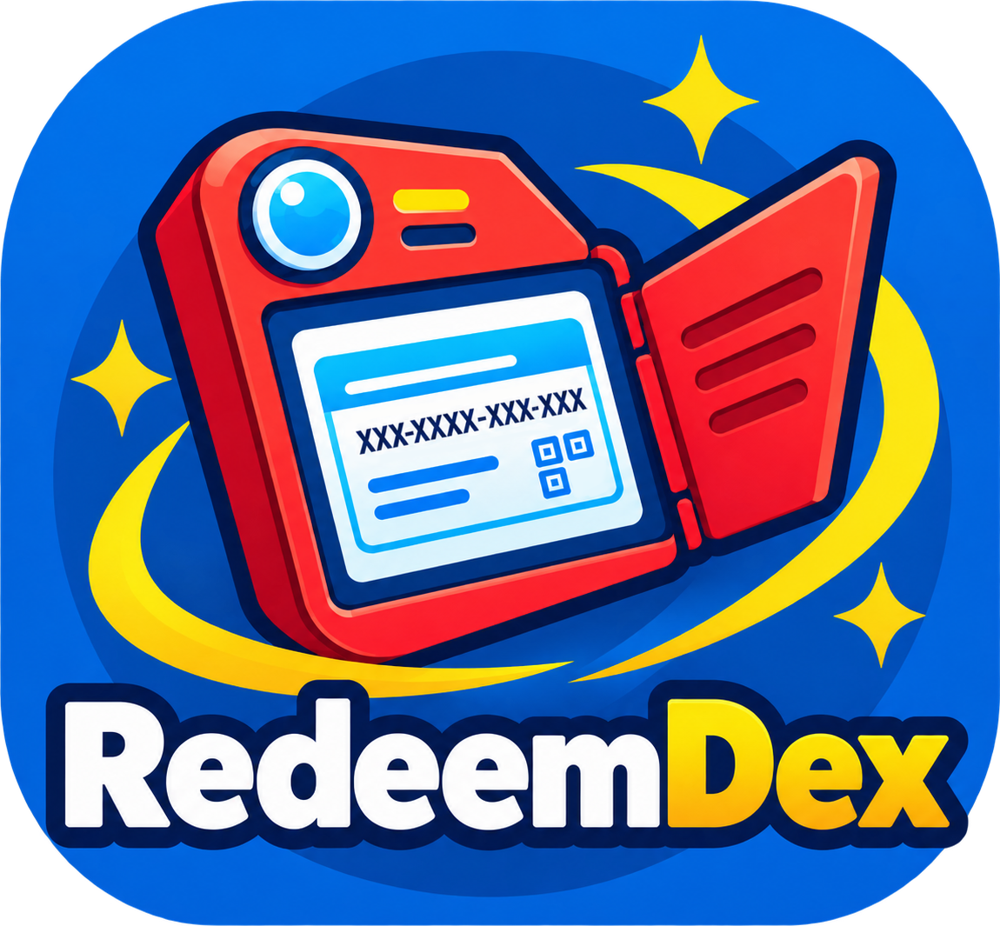

# RedeemDex

[](https://opensource.org/licenses/MIT)
[](https://addons.mozilla.org/en-GB/firefox/addon/redeemdex/)
[](https://chromewebstore.google.com/detail/redeemdex/mkmeoienhkdimaecmkkobbcohemkmnme)

### Redeeming Pokémon TCG Live codes made easy.

<p align="center">

</p>

RedeemDex is a browser extension for [Firefox](https://addons.mozilla.org/en-GB/firefox/addon/redeemdex/) and 
[Chrome](https://chromewebstore.google.com/detail/redeemdex/mkmeoienhkdimaecmkkobbcohemkmnme) that helps with 
redeeming Pokémon TCG Live codes. It keeps the code list and redemption status in local extension storage 
while the content script operates on the official [Pokémon TCG Live Code Redemption](https://redeem.tcg.pokemon.com)
page.

### Acknowledgments

This project is co-authored by GPT-5.6 Luna. 

## Features

- Paste multiple codes into the extension toolbar popup.
- Import one or more codes from a `.txt` file using the file browser or with drag-and-drop.
- Validates code format before redemption.
- Prevent duplicates, including codes already saved in the extension.
- Track pending, valid, redeemed, invalid, and failed codes.
- Detect code status from activity performed directly on the redemption page.
- Follow the system theme or switch between light and dark themes.

## How to use

1. Install the extension with [Firefox](https://addons.mozilla.org/en-GB/firefox/addon/redeemdex/)
   or [Chrome](https://chromewebstore.google.com/detail/redeemdex/mkmeoienhkdimaecmkkobbcohemkmnme).
3. Navigate to the official [Pokémon TCG Live Code Redemption](https://redeem.tcg.pokemon.com)
   and sign in, if needed.
4. Open the **RedeemDex** popup from the extensions toolbar.
5. Paste codes into the input area, or choose **Import** and select or drag-and-drop a `.txt` file.
6. Review the list and click **Start**.
7. Sit back and relax as **RedeemDex** processes all your codes.

|  |  |  |
| :--- | :---: | ---: |
|  |    |  |

## Privacy

 - **RedeemDex** runs entirely locally in your browser and does not send codes or any other information to a separate
   server. Codes and their redemption statuses are stored in the extension's local browser storage. Redemption requests
   are submitted through the official Pokémon TCG Live redemption page in your browser. 

 - **RedeemDex** does not have permission to access the [Pokémon OAuth login page](https://access.pokemon.com/login), 
and therefore cannot access or collect your Pokémon account credentials or login information. Nor does not collect any
personal information, usage data, analytics, or telemetry.

 - **RedeemDex** is fully open source with all code publicly available in this GitHub repository. Builds are automatically
   created by GitHub Actions and published to the repository's Releases section for users who wish to install
   the extension manually.


## Contributing

If you would like to contribute to this project, please feel free to open an 
issue to discuss an idea or submit a pull request with a focused change. Include 
clear steps to reproduce bugs and verify any behavioral changes when possible.

### Requirements

- Node.js and npm
- Firefox or Chrome

### Building from source

Clone the repo, then install dependencies:

```bash
git clone https://github.com/gavin-lb/redeemdex.git
cd redeemdex
npm install
```

Installing dependencies also enables the Husky pre-commit hook. Each commit
runs `npx lint-staged`, which runs `biome check --write` on staged changes.

Then you can build the extensions with
```bash
npm run build:extension
```
Output is written to `extension/dist/prod/firefox/` and
`extension/dist/prod/chrome/` with zipped versions in `extension/dist/prod`.

To load the Firefox build temporarily:

1. Open `about:debugging#/runtime/this-firefox`,
2. Click **Load Temporary Add-on**,
3. Select `extension/dist/prod/firefox/manifest.json`.

To load the Chrome build:
1. Open `chrome://extensions`, 
2. Enable **Developer mode**,
3. Click **Load unpacked**, and select `extension/dist/prod/chrome/`.

Rebuild after source changes and reload the temporary add-on from the same pages.

### Local mock

The repository includes a local mock redemption page for testing without contacting
Pokémon services. It uses the same DOM patterns expected by the content script
and returns simulated redemption outcomes.

To use the mock page, the extension needs additional host permission. To keep these out
of the production build, development build scripts are used to build development versions of
the extension. For a development build with localhost permissions, run the relevant
build script:

```bash
npm run build:extension:firefox:dev
npm run build:extension:chrome:dev
```

This writes the unpacked extension to `extension/dist/dev/firefox/` or
`extension/dist/dev/chrome/` respectively.

Build and serve the mock from the repository root:

```bash
npm run mock
```

Load the relevant extension from `extension/dist/dev` and open `http://127.0.0.1:8000/`. 
The mock is covered by the extension's local host permission in both browser builds.

For Vite development mode:

```bash
npm run dev:mock
```

### Development commands

| Command | Purpose |
| --- | --- |
| `npm run build` | Build the extensions and mock |
| `npm run build:extension` | Build only the extensions |
| `npm run build:extension:firefox:dev` | Build the Firefox extension for local development |
| `npm run build:extension:chrome:dev` | Build the Chrome extension for local development |
| `npm run build:mock` | Build only the mock |
| `npm run check` | Run Biome checks and TypeScript checks |
| `npm run check:fix` | Run Biome checks and TypeScript checks with `--write` |
| `npm run typecheck` | Type-check the extension and mock |
| `npm test` | Run the test suite |
| `npm run dev:extension` | Watch the extension build |
| `npm run dev:mock` | Start the mock in Vite development mode |

### Project layout

```text
extension/
├── src/
│   ├── background/   # Runtime message handling and import logic
│   ├── content/      # Redemption-page DOM integration
│   ├── import/       # React import window and its stylesheet
│   ├── platform/     # WebExtension API and storage adapters
│   ├── popup/        # React toolbar popup
│   └── shared/       # Code validation, constants, and message types
├── public/           # Manifest and extension assets
└── dist/             # Generated extension output

mock/
├── src/              # Mock page, server, and local redemption backend
├── public/           # Mock page assets
└── dist/             # Generated mock output
```

The extension uses Manifest V3 on both browsers. Firefox uses its
`background.scripts` model, while Chrome uses a Manifest V3 `background.service_worker`.
The background and content scripts receive dedicated classic-script builds so
they work in both browsers. Browser-specific manifests are kept in
`extension/manifests/` and generated into each build directory.

## Disclaimer

RedeemDex is an independent community-developed extension. It is not affiliated
with, endorsed by, or sponsored by The Pokémon Company, Nintendo, Creatures
Inc., or Game Freak. Pokémon and Pokémon TCG Live are trademarks of their
respective owners.
